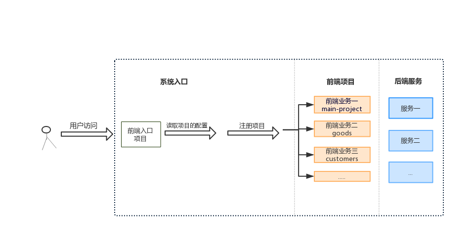

# 运行demo

```cli
    sudo npm run install:all
    sudo npm run start
```

访问`http://localhost:5000/`

# 概念

微前端的概念是从后端的微服务的迁移过来的。将 Web 应用由单一的单体应用转变为多个小型前端应用聚合为一的应用。各个前端应用还可以独立运行、独立开发、独立部署。

微前端只在前后端分离的单页应用中讨论才有意义。单页应用的核心是：在特定的时刻将一段由js运行生成的html代码片段插入到一个特定的位置。微前端项目并没有改变这个核心。微前端的项目与单体项目的差别是：生成html片段的js代码可能位于不同的域名下，所以各个资源的路径最好不要使用相对路径。

微前端项目是由多个子项目组成的，所以需要在微前端项目中声明这个项目是由哪些子项目组成的，这个步骤称为子项目注册。子项目注册做的事情是：给这个项目命名，指定这个项目在什么情况下装载在html文档中，在什么情况从html文档中卸载,所以就会涉及到生命周期的钩子函数。

# 项目结构图



# 在线访问地址

[在线访问地址](http://microfrontend.heyudesign.cn)

# 需要解决的问题

1. 子项目的注册、异步加载和生命周期管理；
2. 子项目之间、主从之间的消息机制；
3. 子项目之间的安全隔离措施；
4. 子项目的框架无关、版本无关；
5. 子项目之间、主从之间的公共依赖的库、业务逻辑(utils)以及版本怎么管理；
6. 子项目独立调试、和主应用联调的方式；
7. 发布

# 实现

> 补充：在这个 demo 中是使用 webpack 打包项目

### 给各个应用注册生命周期函数

> 补充： 在这个 demo 中子项目都是 vue 项目

安装single-spa-vue

```cli
vue add single-spa

// 或者

npm install --save single-spa-vue
```

改写入口文件

```js
import vue from 'vue';
import App from './App.vue';
import router from './router';
import store from './store/base';
import singleSpaVue from 'single-spa-vue';
import elementUI from 'element-ui';
vue.use(elementUI)
vue.config.productionTip = false;
const vueLifecycles = singleSpaVue({
  Vue:vue,
  appOptions: {
    el:'#main',
    render: (h) => h(App),
    router,
    store
  },
});

export const bootstrap = vueLifecycles.bootstrap;
export const mount = vueLifecycles.mount;
export const unmount = vueLifecycles.unmount;
```

## 抽离公共资源

配置`webpack`的 externals 字段使`webpack`在打包的时候不打包公共库如(vue, vue-router, 私有 npm 包等),如下：

```js
{
    externals:['vue',{'vue-router':'vueRouter'},{'element-ui':'elementUI'}]
}
```
## 设置项目打包格式

```
output: {
    ...
    libraryTarget: 'umd',
    library: xxx,
}
```

## 注册子项目

### 各子个项目的配置

```
{
        name:'main-project',
        base:true,
        projectIndex:'http://localhost:9100',
    },
    {
        name:'customers',
        base:false,
        path:'#/customers',
        domID:'main',
        projectIndex:'http://localhost:5100',
    },
    {
        name:'goods',
        base:false,
        path:'#/goods',
        domID:'main',
        projectIndex:'http://localhost:9010',
    }
```

### @hydesign/grape

使用[@hydesign/grape](https://github.com/QxQstar/grape)完成子项目的注册，异步加载和生命周期管理，并且子项目的框架无关，版本无关。[@hydesign/grape](https://github.com/QxQstar/grape)与`webpack`的 externals 配合使用，能够抽离出项目中不想打包的库，并且在项目运行当使用到这个库的时候在动态加载。

```js
 import Grape from '@hydesign/grape';

 new Grape(appsConf)
        .setImportMap({
                "vue": "https://cdn.jsdelivr.net/npm/vue@2.6.10/dist/vue.js",
                "vueRouter": "https://cdn.jsdelivr.net/npm/vue-router@3.0.7/dist/vue-router.min.js",
                "elementUI":"https://cdn.jsdelivr.net/npm/element-ui@2.12.0/lib/index.js",
                "Vuex":"https://cdn.jsdelivr.net/npm/vuex@3.1.1/dist/vuex.min.js",
                "axios":"https://cdn.jsdelivr.net/npm/axios@0.19.0/dist/axios.min.js",
                "hytools":"https://cdn.jsdelivr.net/npm/hytools@1.2.0/dist/index.js"
            })
        .start()
```

## 给子项目的入口js加标识

经过`webpack`打包之后一个项目在 index.html 中插入的 js 脚本可能不只一个，所以在为了确保[@hydesign/grape](https://github.com/QxQstar/grape)能够正确的从项目访问入口中解析要入口js，给入口 js 文件加上一个自定义属性

``` 
const ScriptExtHtmlWebpackPlugin = require('script-ext-html-webpack-plugin')
plugins:[
    ...
    new ScriptExtHtmlWebpackPlugin({
      custom: {
        test: /app.*\.js$/,
        attribute: 'entry',
        value: true
      }
    })
  ]
```

## 配置跨域访问

```cli
    devServer:{
        ...
        headers: {
            "Access-Control-Allow-Origin": "*",
        },
    },
```

由于子项目的资源需要在入口项目中访问，所以需要在子项目中配置跨域访问

## 资源的访问路径

由于子项目的资源是在入口项目(入口项目和子项目在不同的域)中访问，所以需要将子项目的 publicPath 设置为完整的路径（即：包括协议和域名），这样才能保证子项目的资源能够正确加载。[output.publicPath](https://www.webpackjs.com/configuration/output/#output-publicpath)

## 各个应用间进行通信

使用浏览器自定义事件来实现各个应用间的通讯

```js
// customers
window.dispatchEvent(new CustomEvent('logout'));

// main-project
 window.addEventListener('logout',handler);
```

> 注意：各个应用之间应该尽可能少的进行通信，如果两个应用之间频繁的进行通信，那么它们两个应该合并成一个

## 隔离css样式

使用`webpack`，`postcss`在构建阶段为业务的所有 CSS 都加上自己的作用域

```
postcss:{
    plugins:[require('postcss-plugin-namespace')('.main-project',{ ignore: [ '*'] })]
}
```

## 独立运行

使用 cross-env 设置环境变量，在入口js文件中访问环境变量 process.env.VUE_APP_SINGLERUN 的值决定是否new 一个vue根实例

## 参考文章

* [single-spa](https://single-spa.js.org/)
* [@hydesign/grape](https://github.com/QxQstar/grape)
* [微前端那些事儿](https://github.com/phodal/microfrontends)
* [每日优鲜供应链前端团队微前端改造](https://juejin.im/post/5d7f702ce51d4561f777e258)
* [微前端项目](https://segmentfault.com/a/1190000019957162)
* [用微前端的方式搭建类单页应用-美团技术团队](https://tech.meituan.com/2018/09/06/fe-tiny-spa.html)
