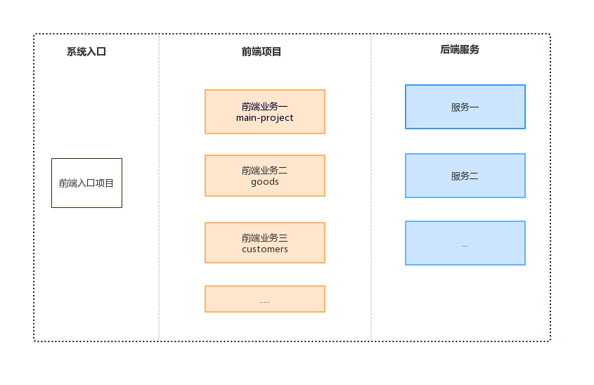

[](微前端)

[](微前端背后的核心理念)
[](与技术无关)
[](代码隔离)
[](建立命名空间)
[](在不能完全隔离的情况下，在个项目中使用命令空间避免css，事件，Cookies，LocalStorage冲突)

[](优先使用浏览器自身的特性，而不是自定义的api)
[](使用浏览器自带的事件进行通信，而不是使用全局的发布订阅系统)

[](设计理念)
[](中心化：应用注册表。这个应用注册表拥有每个应用及对应的入口。)
[](标识化应用：我们需要一个标识符来标识不同的应用，以便于在安装、卸载的时候，能寻找到指定的应用。)

[](https://user-gold-cdn.xitu.io/2019/4/10/16a07137f3993690?imageView2/0/w/1280/h/960/format/webp/ignore-error/1)

[](需要解决的问题)
[](业务工程每次有变更，app.js等资源路径上都会带有新的文件内容哈希值，所以需要解析应用html中的入口文件的文件名，通过正则就能匹配到app.js等资源的路径，动态生成注册表中的资源路径)
[](当路径发生变更时，匹配到业务工程，然后执行卸载、加载的工作，利用single-spa来实现)
[](各个应用支持独立运行和集成运行。可能的解决方案使用一个变量来控制是否是独立运行)

# 基于single-spa的vue微前端项目

微前端的概念是从后端的微服务的迁移过来的。将 Web 应用由单一的单体应用转变为多个小型前端应用聚合为一的应用。各个前端应用还可以独立运行、独立开发、独立部署。
> 注意：这里的前端应用指的是前后端分离的单页面应用

## single-spa
single-spa是一个可以将多个前端应用聚合到同一个页面展示的框架。换句话说: single-spa会监听路由的变化，它会在特定的路由下将相应的应用挂载到指定的DOM节点上。

## 设计理念
* 中心化路由

在前端应用中路由是中心，因为有了路由才能展示相应的界面。在基于single-spa的微前端项目中我们需要一个地方去管理我们的应用，即：发现存在哪些应用，这些应用都对应了哪个路由，在特定的路由先去加载这个应用对应的资源

* 标识化应用

给每个应用都起一个唯一的名字。

* 生命周期

single-spa设计了一个基本的生命周期，有五个状态：
1. load: 决定加载哪个应用，并绑定生命周期
2. bootstrap: 获取静态资源
3. mount: 安装应用，如创建 DOM 节点
4. unload: 删除应用的生命周期
5. unmount: 卸载应用，如删除 DOM 节点

* 独立部署与配置自动化

现在的前端项目的部署很大程度都是围绕这配置进行的，如果应用的配置能自动化，那么整个系统就自动化。如果我们要在微前端项目中添加或者删除一个应用，我们就更新微前端项目的配置，而这个配置应该自动生成。

## 实现方案
> 补充：我是使用systemJs加载静态资源
### 配置各个应用的入口
```json
{
        "imports": {
          "goods": "http://localhost:9010/app.js",
          "customers": "http://localhost:5100/app.js",
          "main-project":"http://localhost:9100/app.js"
        }
      }
```
goods，customers和main-project是三个独立的项目,这个应该在各个项目部署的时候自动生成，

### 注册应用
```js
function isActive(location,page) {
    const hash = location.hash.slice(2),
        hashArr = hash.split('/');

    return hashArr[0] === page;
}
const activeFns = {
    goods(location) {
        return isActive(location,'goods')
    },
    customer() {
        return isActive(location,'customers')
    },
    main() {
        return true;
    }
}

singleSpa.registerApplication('main-project',() => System.import('main-project'),activeFns.main);

singleSpa.registerApplication('customers',() => System.import('customers'),activeFns.customer);

singleSpa.registerApplication('goods',() => System.import('goods'),activeFns.goods);

```

### 启动single-spa
```js
    singleSpa.start();
```


### 给各个应用注册生命周期函数
single-spa-vue是一个在vue项目中注册single-spa生命周期的工具库。

安装single-spa-vue
```cli
vue add single-spa

// 或者

npm install --save single-spa-vue
```

改写入口文件
```js
import vue from 'vue';
import App from './App.vue';
import router from './router';
import store from './store/base';
import singleSpaVue from 'single-spa-vue';
vue.use(elementUI)
vue.config.productionTip = false;
const vueLifecycles = singleSpaVue({
  Vue:vue,
  appOptions: {
    el:'#main',
    render: (h) => h(App),
    router,
    store
  },
});

export const bootstrap = vueLifecycles.bootstrap;
export const mount = vueLifecycles.mount;
export const unmount = vueLifecycles.unmount;
```

## 项目结构图



### 前端入口项目
前端入口项目不写业务代码，只是用于获取业务项目的配置(即：存在哪些业务项目，业务项目的入口)，注册各个业务项目以及加载各个业务项目的公共资源，入口项目有一个html文件，在业务项目处于激活状态时，将业务项目的DOM树挂载到入口项目的html中。

### 业务项目
业务项目的路由由自己定义，业务项目对外输出不需要入口HTML页面，只需要输出的资源文件即可，资源文件包括js、css、fonts和imgs等。在整个微前端项目中，业务项目是按需加载。

